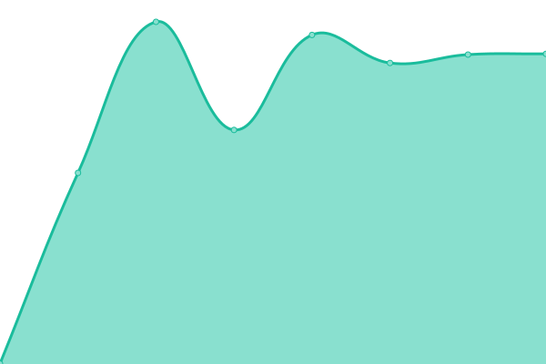
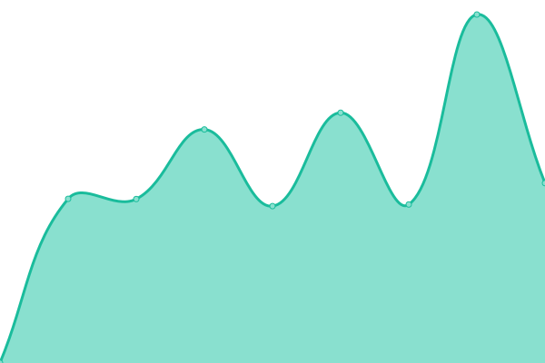
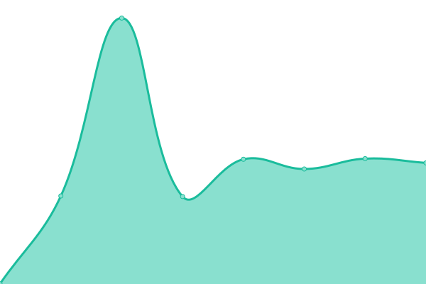
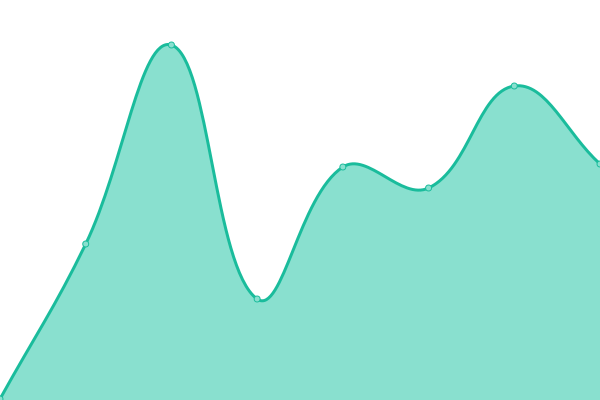

# [📈 Live Status](https://upptime.github.io/upptime): <!--live status--> **🟧 Partial outage**

This repository contains the open-source uptime monitor and status page for [Upptime](https://upptime.js.org), powered by [Upptime](https://github.com/upptime/upptime).

With [Upptime](https://upptime.js.org), you can get your own unlimited and free uptime monitor and status page, powered entirely by a GitHub repository. We use [Issues](https://github.com/upptime/upptime/issues) as incident reports, [Actions](https://github.com/AkumaX1/uptime/actions) as uptime monitors, and [Pages](https://upptime.github.io/upptime) for the status page.

<!--start: status pages-->
<!-- This summary is generated by Upptime (https://github.com/upptime/upptime) -->
<!-- Do not edit this manually, your changes will be overwritten -->
<!-- prettier-ignore -->
| URL | Status | History | Response Time | Uptime |
| --- | ------ | ------- | ------------- | ------ |
|  [Prism break / Opt out of global data surveillance](https://prism-break.org/en/) | 🟩 Up | [prism-break-opt-out-of-global-data-surveillance.yml](https://github.com/AkumaX1/uptime/commits/HEAD/history/prism-break-opt-out-of-global-data-surveillance.yml) | 

 693ms
     
 | 

<a href="https://AkumaX1.github.io/uptime/history/prism-break-opt-out-of-global-data-surveillance">100.00%</a>
    

|  [1337x](https://www.1377x.to/) | 🟩 Up | [1337x.yml](https://github.com/AkumaX1/uptime/commits/HEAD/history/1337x.yml) | 

 183ms
     
 | 

<a href="https://AkumaX1.github.io/uptime/history/1337x">100.00%</a>
    

|  [1337x official domain 2](https://1337xto.to/) | 🟩 Up | [1337x-official-domain-2.yml](https://github.com/AkumaX1/uptime/commits/HEAD/history/1337x-official-domain-2.yml) | 

 216ms
     
 | 

<a href="https://AkumaX1.github.io/uptime/history/1337x-official-domain-2">100.00%</a>
    

|  [1337x official domain 3](https://www.1337xx.to/) | 🟩 Up | [1337x-official-domain-3.yml](https://github.com/AkumaX1/uptime/commits/HEAD/history/1337x-official-domain-3.yml) | 

 331ms
     
 | 

<a href="https://AkumaX1.github.io/uptime/history/1337x-official-domain-3">100.00%</a>
    

|  [Thepiratebay official](https://thepiratebay.org/) | 🟩 Up | [thepiratebay-official.yml](https://github.com/AkumaX1/uptime/commits/HEAD/history/thepiratebay-official.yml) | 

 1154ms
     
 | 

<a href="https://AkumaX1.github.io/uptime/history/thepiratebay-official">12.63%</a>
    

|  [Rarbg](https://rarbgprx.org/) | 🟩 Up | [rarbg.yml](https://github.com/AkumaX1/uptime/commits/HEAD/history/rarbg.yml) | 

 2003ms
     
 | 

<a href="https://AkumaX1.github.io/uptime/history/rarbg">99.74%</a>
    

|  [Proxygalaxy](https://proxygalaxy.pw/) | 🟩 Up | [proxygalaxy.yml](https://github.com/AkumaX1/uptime/commits/HEAD/history/proxygalaxy.yml) | 

 745ms
     
 | 

<a href="https://AkumaX1.github.io/uptime/history/proxygalaxy">100.00%</a>
    

|  [Rutracker](https://rutracker.org/forum/index.php) | 🟩 Up | [rutracker.yml](https://github.com/AkumaX1/uptime/commits/HEAD/history/rutracker.yml) | 

 1926ms
     
 | 

<a href="https://AkumaX1.github.io/uptime/history/rutracker">100.00%</a>
    

|  [nyaa](https://nyaa.si/) | 🟩 Up | [nyaa.yml](https://github.com/AkumaX1/uptime/commits/HEAD/history/nyaa.yml) | 

 586ms
     
 | 

<a href="https://AkumaX1.github.io/uptime/history/nyaa">100.00%</a>
    

|  [Tokyotosho](https://www.tokyotosho.info/) | 🟩 Up | [tokyotosho.yml](https://github.com/AkumaX1/uptime/commits/HEAD/history/tokyotosho.yml) | 

 585ms
     
 | 

<a href="https://AkumaX1.github.io/uptime/history/tokyotosho">95.12%</a>
    

|  [Anidex](https://anidex.info/) | 🟥 Down | [anidex.yml](https://github.com/AkumaX1/uptime/commits/HEAD/history/anidex.yml) | 

 673ms
     
 | 

<a href="https://AkumaX1.github.io/uptime/history/anidex">87.04%</a>
    

|  [Fitgirl Repack](https://fitgirl-repacks.site/) | 🟩 Up | [fitgirl-repack.yml](https://github.com/AkumaX1/uptime/commits/HEAD/history/fitgirl-repack.yml) | 

 685ms
     
 | 

<a href="https://AkumaX1.github.io/uptime/history/fitgirl-repack">99.79%</a>
    

|  [gnarly repacks](https://www.gnarly-repacks.site/) | 🟩 Up | [gnarly-repacks.yml](https://github.com/AkumaX1/uptime/commits/HEAD/history/gnarly-repacks.yml) | 

 619ms
     
 | 

<a href="https://AkumaX1.github.io/uptime/history/gnarly-repacks">100.00%</a>
    

|  [Mobilism](https://forum.mobilism.org/index.php) | 🟩 Up | [mobilism.yml](https://github.com/AkumaX1/uptime/commits/HEAD/history/mobilism.yml) | 

 1078ms
     
 | 

<a href="https://AkumaX1.github.io/uptime/history/mobilism">100.00%</a>
    

|  [Libgen](https://libgen.fun/) | 🟩 Up | [libgen.yml](https://github.com/AkumaX1/uptime/commits/HEAD/history/libgen.yml) | 

 266ms
     
 | 

<a href="https://AkumaX1.github.io/uptime/history/libgen">95.15%</a>
    

|  [knaben](https://knaben.info/) | 🟩 Up | [knaben.yml](https://github.com/AkumaX1/uptime/commits/HEAD/history/knaben.yml) | 

 1286ms
     
 | 

<a href="https://AkumaX1.github.io/uptime/history/knaben">100.00%</a>
    

|  [kaffeine](https://kaffeine.herokuapp.com/) | 🟩 Up | [kaffeine.yml](https://github.com/AkumaX1/uptime/commits/HEAD/history/kaffeine.yml) | 

 174ms
     
 | 

<a href="https://AkumaX1.github.io/uptime/history/kaffeine">100.00%</a>
    

|  [Invidious](https://invidious.kavin.rocks/) | 🟩 Up | [invidious.yml](https://github.com/AkumaX1/uptime/commits/HEAD/history/invidious.yml) | 

 3165ms
     
 | 

<a href="https://AkumaX1.github.io/uptime/history/invidious">80.61%</a>
    

|  [cock.li](https://cock.li/) | 🟩 Up | [cock-li.yml](https://github.com/AkumaX1/uptime/commits/HEAD/history/cock-li.yml) | 

 3433ms
     
 | 

<a href="https://AkumaX1.github.io/uptime/history/cock-li">100.00%</a>
    

|  [Riseup](https://riseup.net/en) | 🟩 Up | [riseup.yml](https://github.com/AkumaX1/uptime/commits/HEAD/history/riseup.yml) | 

 587ms
     
 | 

<a href="https://AkumaX1.github.io/uptime/history/riseup">100.00%</a>
    

|  [Disroot](https://disroot.org/en) | 🟩 Up | [disroot.yml](https://github.com/AkumaX1/uptime/commits/HEAD/history/disroot.yml) | 

 1053ms
     
 | 

<a href="https://AkumaX1.github.io/uptime/history/disroot">100.00%</a>
    

|  [Autistici](https://www.autistici.org/) | 🟩 Up | [autistici.yml](https://github.com/AkumaX1/uptime/commits/HEAD/history/autistici.yml) | 

 863ms
     
 | 

<a href="https://AkumaX1.github.io/uptime/history/autistici">100.00%</a>
    

<!--end: status pages-->

[**Visit our status website →**](https://upptime.github.io/upptime)

## 📄 License

- Powered by: [Upptime](https://github.com/upptime/upptime)
- Code: [MIT](./LICENSE) © [Upptime](https://upptime.js.org)
- Data in the `./history` directory: [Open Database License](https://opendatacommons.org/licenses/odbl/1-0/)
