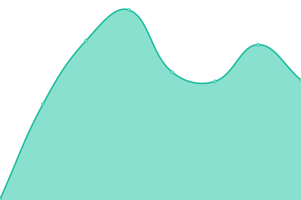
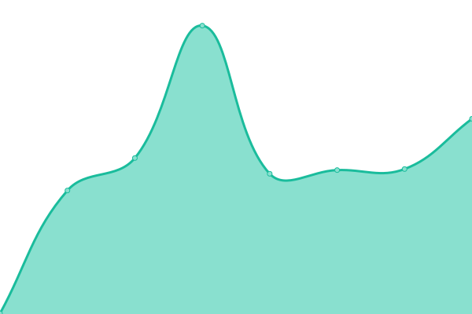
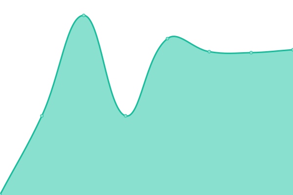
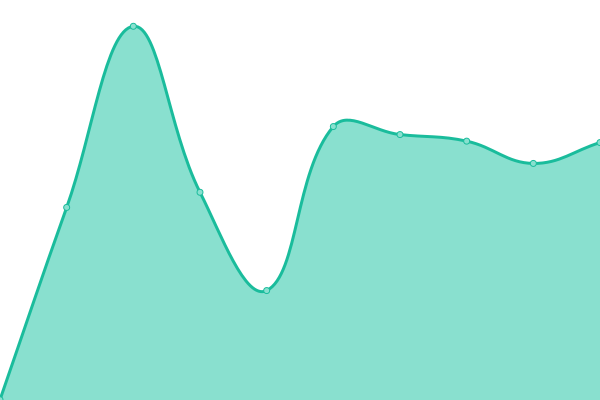

# [📈 Live Status](https://upptime.github.io/upptime): <!--live status--> **🟧 Partial outage**

This repository contains the open-source uptime monitor and status page for [Upptime](https://upptime.js.org), powered by [Upptime](https://github.com/upptime/upptime).

With [Upptime](https://upptime.js.org), you can get your own unlimited and free uptime monitor and status page, powered entirely by a GitHub repository. We use [Issues](https://github.com/upptime/upptime/issues) as incident reports, [Actions](https://github.com/AkumaX1/uptime/actions) as uptime monitors, and [Pages](https://upptime.github.io/upptime) for the status page.

<!--start: status pages-->
<!-- This summary is generated by Upptime (https://github.com/upptime/upptime) -->
<!-- Do not edit this manually, your changes will be overwritten -->
<!-- prettier-ignore -->
| URL | Status | History | Response Time | Uptime |
| --- | ------ | ------- | ------------- | ------ |
|  [1337x](https://www.1377x.to/) | 🟩 Up | [1337x.yml](https://github.com/AkumaX1/uptime/commits/HEAD/history/1337x.yml) | 

 294ms
     
 | 

<a href="https://AkumaX1.github.io/uptime/history/1337x">100.00%</a>
    

|  [1337x official domain 2](https://1337xto.to/) | 🟩 Up | [1337x-official-domain-2.yml](https://github.com/AkumaX1/uptime/commits/HEAD/history/1337x-official-domain-2.yml) | 

 289ms
     
 | 

<a href="https://AkumaX1.github.io/uptime/history/1337x-official-domain-2">100.00%</a>
    

|  [1337x official domain 3](https://www.1337xx.to/) | 🟩 Up | [1337x-official-domain-3.yml](https://github.com/AkumaX1/uptime/commits/HEAD/history/1337x-official-domain-3.yml) | 

 171ms
     
 | 

<a href="https://AkumaX1.github.io/uptime/history/1337x-official-domain-3">100.00%</a>
    

|  [1337x official domain 4](https://1337x.gd/) | 🟥 Down | [1337x-official-domain-4.yml](https://github.com/AkumaX1/uptime/commits/HEAD/history/1337x-official-domain-4.yml) | 

 135ms
     
 | 

<a href="https://AkumaX1.github.io/uptime/history/1337x-official-domain-4">0.16%</a>
    

|  [Rarbg](https://rarbgprx.org/) | 🟩 Up | [rarbg.yml](https://github.com/AkumaX1/uptime/commits/HEAD/history/rarbg.yml) | 

 1001ms
     
 | 

<a href="https://AkumaX1.github.io/uptime/history/rarbg">100.00%</a>
    

|  [torrentproxygalaxy](https://proxygalaxy.pw/) | 🟩 Up | [torrentproxygalaxy.yml](https://github.com/AkumaX1/uptime/commits/HEAD/history/torrentproxygalaxy.yml) | 

 987ms
     
 | 

<a href="https://AkumaX1.github.io/uptime/history/torrentproxygalaxy">100.00%</a>
    

|  [zooqle](https://zooqle.com/) | 🟥 Down | [zooqle.yml](https://github.com/AkumaX1/uptime/commits/HEAD/history/zooqle.yml) | 

 203ms
     
 | 

<a href="https://AkumaX1.github.io/uptime/history/zooqle">0.27%</a>
    

|  [nyaa](https://nyaa.si/) | 🟩 Up | [nyaa.yml](https://github.com/AkumaX1/uptime/commits/HEAD/history/nyaa.yml) | 

 566ms
     
 | 

<a href="https://AkumaX1.github.io/uptime/history/nyaa">100.00%</a>
    

|  [tokyotosho](https://www.tokyotosho.info/) | 🟩 Up | [tokyotosho.yml](https://github.com/AkumaX1/uptime/commits/HEAD/history/tokyotosho.yml) | 

 816ms
     
 | 

<a href="https://AkumaX1.github.io/uptime/history/tokyotosho">100.00%</a>
    

|  [Anidex](https://anidex.info/) | 🟥 Down | [anidex.yml](https://github.com/AkumaX1/uptime/commits/HEAD/history/anidex.yml) | 

 780ms
     
 | 

<a href="https://AkumaX1.github.io/uptime/history/anidex">93.63%</a>
    

|  [Fitgirl Repack](https://fitgirl-repacks.site/) | 🟩 Up | [fitgirl-repack.yml](https://github.com/AkumaX1/uptime/commits/HEAD/history/fitgirl-repack.yml) | 

 1381ms
     
 | 

<a href="https://AkumaX1.github.io/uptime/history/fitgirl-repack">100.00%</a>
    

|  [Libgen](https://libgen.fun/) | 🟩 Up | [libgen.yml](https://github.com/AkumaX1/uptime/commits/HEAD/history/libgen.yml) | 

 327ms
     
 | 

<a href="https://AkumaX1.github.io/uptime/history/libgen">100.00%</a>
    

|  [1lib](https://1lib.in/) | 🟩 Up | [1lib.yml](https://github.com/AkumaX1/uptime/commits/HEAD/history/1lib.yml) | 

 3612ms
     
 | 

<a href="https://AkumaX1.github.io/uptime/history/1lib">100.00%</a>
    

|  [Audiobookbay](http://audiobookbay.nl/) | 🟥 Down | [audiobookbay.yml](https://github.com/AkumaX1/uptime/commits/HEAD/history/audiobookbay.yml) | 

 0ms
     
 | 

<a href="https://AkumaX1.github.io/uptime/history/audiobookbay">4.74%</a>
    

|  [knaben](https://knaben.info/) | 🟩 Up | [knaben.yml](https://github.com/AkumaX1/uptime/commits/HEAD/history/knaben.yml) | 

 660ms
     
 | 

<a href="https://AkumaX1.github.io/uptime/history/knaben">100.00%</a>
    

|  [kaffeine](https://kaffeine.herokuapp.com/) | 🟩 Up | [kaffeine.yml](https://github.com/AkumaX1/uptime/commits/HEAD/history/kaffeine.yml) | 

 310ms
     
 | 

<a href="https://AkumaX1.github.io/uptime/history/kaffeine">100.00%</a>
    

|  [invidious](https://invidious.kavin.rocks/) | 🟩 Up | [invidious.yml](https://github.com/AkumaX1/uptime/commits/HEAD/history/invidious.yml) | 

 1044ms
     
 | 

<a href="https://AkumaX1.github.io/uptime/history/invidious">100.00%</a>
    

|  [cock.li](https://cock.li/) | 🟩 Up | [cock-li.yml](https://github.com/AkumaX1/uptime/commits/HEAD/history/cock-li.yml) | 

 2326ms
     
 | 

<a href="https://AkumaX1.github.io/uptime/history/cock-li">100.00%</a>
    

<!--end: status pages-->

[**Visit our status website →**](https://upptime.github.io/upptime)

## 📄 License

- Powered by: [Upptime](https://github.com/upptime/upptime)
- Code: [MIT](./LICENSE) © [Upptime](https://upptime.js.org)
- Data in the `./history` directory: [Open Database License](https://opendatacommons.org/licenses/odbl/1-0/)
