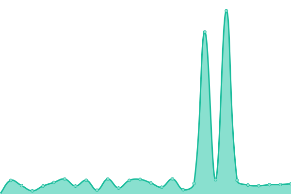

# [📈 Live Status](https://upptime.github.io/upptime): <!--live status--> **🟧 Partial outage**

This repository contains the open-source uptime monitor and status page for [Upptime](https://upptime.js.org), powered by [Upptime](https://github.com/upptime/upptime).

With [Upptime](https://upptime.js.org), you can get your own unlimited and free uptime monitor and status page, powered entirely by a GitHub repository. We use [Issues](https://github.com/upptime/upptime/issues) as incident reports, [Actions](https://github.com/upptime/upptime/actions) as uptime monitors, and [Pages](https://upptime.github.io/upptime) for the status page.

<!--start: status pages-->
<!-- This summary is generated by Upptime (https://github.com/upptime/upptime) -->
<!-- Do not edit this manually, your changes will be overwritten -->
<!-- prettier-ignore -->
| URL | Status | History | Response Time | Uptime |
| --- | ------ | ------- | ------------- | ------ |
|  [1337x](https://www.1377x.to/) | 🟩 Up | [1337x.yml](https://github.com/AkumaX1/uptime/commits/HEAD/history/1337x.yml) | 

 269ms
     
 | 

<a href="https://upptime.github.io/upptime/history/1337x">100.00%</a>
    

|  [Piratebayproxy](https://pirate-proxy.me/) | 🟥 Down | [piratebayproxy.yml](https://github.com/AkumaX1/uptime/commits/HEAD/history/piratebayproxy.yml) | 

 84ms
     
 | 

<a href="https://upptime.github.io/upptime/history/piratebayproxy">7.76%</a>
    

|  [invidious](https://invidious.kavin.rocks/) | 🟩 Up | [invidious.yml](https://github.com/AkumaX1/uptime/commits/HEAD/history/invidious.yml) | 

 1404ms
     
 | 

<a href="https://upptime.github.io/upptime/history/invidious">100.00%</a>
    

|  [cock.li](https://cock.li/) | 🟩 Up | [cock-li.yml](https://github.com/AkumaX1/uptime/commits/HEAD/history/cock-li.yml) | 

 1593ms
     
 | 

<a href="https://upptime.github.io/upptime/history/cock-li">100.00%</a>
    

<!--end: status pages-->

[**Visit our status website →**](https://upptime.github.io/upptime)

## 📄 License

- Powered by: [Upptime](https://github.com/upptime/upptime)
- Code: [MIT](./LICENSE) © [Upptime](https://upptime.js.org)
- Data in the `./history` directory: [Open Database License](https://opendatacommons.org/licenses/odbl/1-0/)
